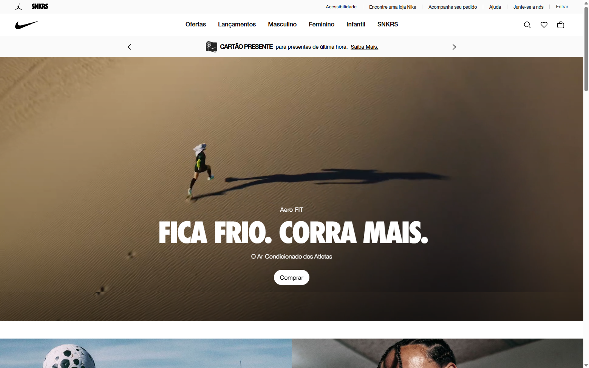
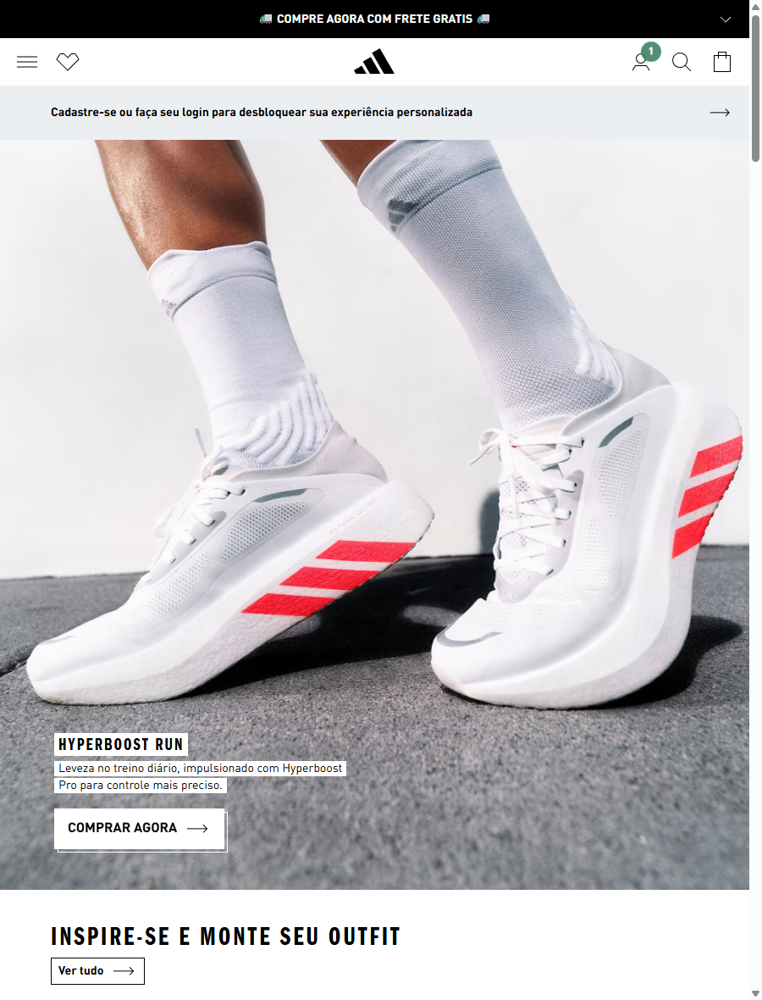

# Especificações Técnicas e Diário de Bordo - Projeto Maratona

Este documento tem como objetivo registrar e justificar todas as decisões técnicas e de design tomadas durante o desenvolvimento do projeto **Maratona**, além de servir como um diário de progresso das tarefas executadas.

---

## 1. Decisões de UI/UX e Design Visual

### 1.1. Benchmarking: Padrão da Indústria

Para definir a identidade visual e a paleta de cores do e-commerce, foi realizada uma análise detalhada da Interface de Usuário (UI)  de algumas das principais marcas de artigos esportivos do mercado: **Nike, Adidas, Reebok e Mizuno**. 

O padrão da indústria que se destacou de forma claríssima foi:

*   **Adidas:** Fundo 100% branco na vitrine, textos e ícones em preto absoluto. É possível notar uma grande área de respiro (whitespace) entre os elementos.
*   **Nike:** Fundo branco predominante na área dos produtos, porém com uma diversidade maior de fotos de estilo de vida, exibindo poucos produtos simultaneamente na tela principal (Home).
*   **Reebok:** O mesmo fundo branco dominando a vitrine de ponta a ponta, com uso de preto nos textos e assets secundários, reservando sua cor de destaque (vermelho) apenas para o logo.
*   **Mizuno:** Base branca, textos em preto e utilização do azul apenas para pontos de destaque (como botões e o próprio logo).

Para ilustrar essa análise, abaixo estão algumas referências dos sites analisados:

  
  

### 1.2. Justificativa da Paleta de Cores (White Theme)

> *"Por que todas as gigantes do mercado esportivo adotam esse padrão minimalista?"*

No e-commerce de calçados, **o produto é a única estrela**. Tênis de corrida e de alta performance já costumam ter cores extremamente agressivas e vibrantes (verde neon, laranja choque, solados coloridos, detalhes reflexivos). 

Se aplicarmos um fundo escuro (Dark Mode) ou muito chamativo no site, o visual geral ficará poluído. O fundo acabaria "brigando" com a fotografia do tênis pela atenção do usuário. O fundo branco puro (ou *off-white*) resolve essa questão pois:

1.  Faz com que as cores do tênis saltem e ganhem destaque imediato na tela.
2.  Passa uma sensação de ambiente limpo, organizado e seguro (fatores essenciais para transmitir confiança na hora de passar o cartão de crédito).
3.  Melhora absurdamente a legibilidade dos textos descritivos e dos preços.

**Decisão Final:**
*Eu analisei a UI da Nike, Adidas e Mizuno e notei o padrão absoluto de fundos brancos. Como os tênis de alta performance já são muito coloridos por natureza, optei por seguir esse padrão de UX validado pelo mercado. Isso evita a fadiga visual e direciona o foco e a atenção do usuário 100% para o botão de conversão (Comprar).*

---

## 2. Diário de Desenvolvimento

Aqui serão registradas as tarefas executadas ao longo do projeto.

### [26/08/2026] - Planejamento de UI/UX
- [x] Criação do arquivo de Especificações e Diário de Bordo.
- [x] Realização de análise de mercado e Benchmarking com grandes players.
- [x] Definição e documentação da paleta de cores e identidade visual do projeto (Fundo Branco vs. Produto Colorido).
