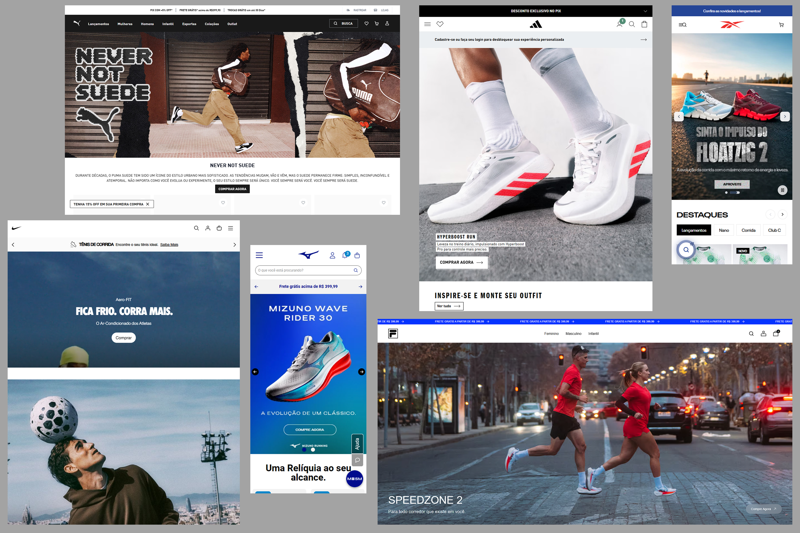
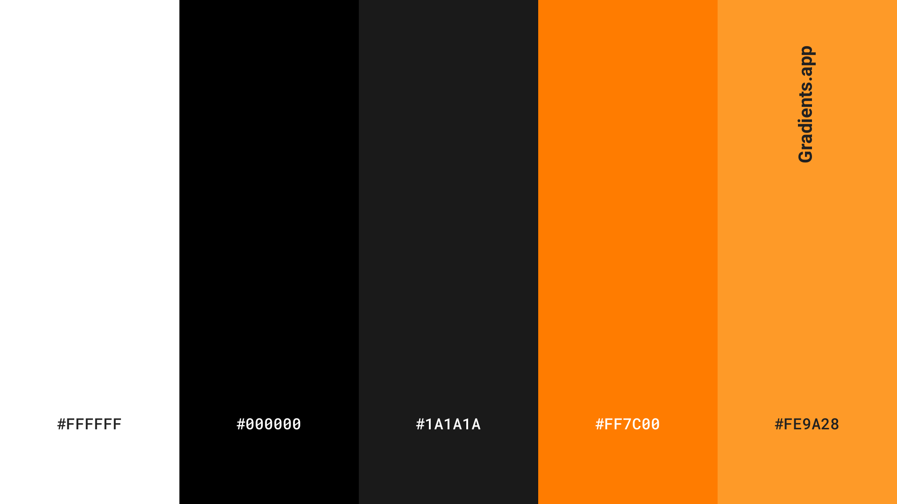

# Especificações Técnicas e Diário de Bordo - Projeto **Maratona**

Este documento tem como objetivo registrar e justificar todas as decisões técnicas tomadas durante o desenvolvimento do projeto **Maratona**, além de servir como um diário de progresso das tarefas executadas.

> [!NOTE]
> **Aviso de Co-autoria:** Parte da estruturação visual, formatação em Markdown e a redação final das justificativas técnicas deste documento foram feitas com o **Gemini** (Inteligência Artificial).

---

## Sumário
- [1. Identidade Visual e UI/UX](#1-identidade-visual-e-uiux)
  - [1.1. Benchmarking: Padrão da Indústria](#11-benchmarking-padrão-da-indústria)
  - [1.2. Justificativa da Paleta de Cores (White Theme)](#12-justificativa-da-paleta-de-cores-white-theme)
  - [1.3. Definição da Paleta de Cores](#13-definição-da-paleta-de-cores)
  - [1.4. Tipografia](#14-tipografia)
- [2. Diário de Desenvolvimento](#2-diário-de-desenvolvimento)

---

## 1. Identidade Visual e UI/UX

### 1.1. Benchmarking: Padrão da Indústria

Para definir a identidade visual e a paleta de cores do e-commerce, foi realizada uma análise detalhada da Interface de Usuário (UI)  de algumas das principais marcas de artigos esportivos do mercado: **Nike, Adidas, Reebok, Fila, Puma e Mizuno**. 

O padrão da indústria que se destacou de forma claríssima foi a utilização unânime de **fundos 100% brancos** na área de vitrine, combinados com textos e ícones em **preto absoluto**, garantindo alto contraste e amplas áreas de respiro (*whitespace*). Nessas interfaces, as cores de identidade da marca (como o vermelho da Reebok ou o azul da Mizuno) são restritas a pequenos pontos de destaque, como logotipos ou botões. A intenção é que a fotografia do produto (seja em fundo infinito ou cenas de *lifestyle*, como faz a Nike) domine completamente o campo visual.

Para ilustrar essa análise, abaixo estão algumas referências dos sites analisados: 

  

### 1.2. Justificativa da Paleta de Cores (White Theme)

> *"Por que todas as gigantes do mercado esportivo adotam esse padrão minimalista?"*

No e-commerce de artigos esportivos, **o produto é a única estrela**. Vestuário de corrida e tênis de alta performance já costumam ter cores extremamente agressivas e vibrantes (verde neon, laranja choque, solados coloridos, detalhes reflexivos). 

Se aplicarmos um fundo escuro (Dark Mode) ou muito chamativo no site, o visual geral ficará poluído. O fundo acabaria "brigando" com a fotografia do produto pela atenção do usuário. O fundo branco puro (ou *off-white*) resolve essa questão pois:

1.  Faz com que as cores do tênis saltem e ganhem destaque imediato na tela.
2.  Passa uma sensação de ambiente limpo, organizado e seguro (fatores essenciais para transmitir confiança na hora de passar o cartão de crédito).
3.  Melhora absurdamente a legibilidade dos textos descritivos e dos preços.

### 1.3. Definição da Paleta de Cores

Para a loja **Maratona**, a paleta com destaque em **laranja** se encaixa perfeitamente na proposta de "Alta Performance". Ela cria o contraste agressivo desejado, mas mantendo a viabilidade comercial que deixará a loja com o aspecto visual de uma gigante do varejo esportivo.

Abaixo, a estruturação base do projeto:

*   **Fundo (Background):** `#FFFFFF`
*   **Texto Principal/Títulos:** `#000000`
*   **Textos Secundários/Rodapé:** `#1A1A1A`
*   **Destaque Primário (Botões de Compra):** `#FF7C00`
*   **Destaque Secundário (Tags/Hover):** `#FE9A28`

  

### 1.4. Tipografia

As fontes escolhidas (via Google Fonts) focam em transmitir movimento e garantir legibilidade:

*   **Títulos (Headers/Banners):** `Barlow Condensed`
    *   *Uso:* Peso **800 (ExtraBold) em Itálico**.
    *   *Justificativa:* A inclinação do itálico aliada à espessura da fonte transmite a sensação de velocidade e avanço, alinhando-se à estética de alta performance.
*   **Corpo de Texto (Preços, descrições, botões):** `Inter`
    *   *Uso:* Pesos **300 (Light) ou 400 (Regular)**.
    *   *Justificativa:* Fonte altamente legível e limpa. Seu design neutro equilibra a agressividade visual da Barlow, garantindo conforto na leitura técnica.

---

## 2. Diário de Desenvolvimento

Aqui serão registradas as tarefas executadas ao longo do projeto.

### [26/08/2026] - Planejamento de UI/UX + Catálogo 
- [x] Criação do arquivo de Especificações e Diário de Bordo.
- [x] Realização de análise de mercado e Benchmarking com grandes players.
- [x] Definição da paleta de cores.
- [x] Definição da tipografia.
- [x] Comecei a fazer o catalogo dos produtos (3 Tênis).
