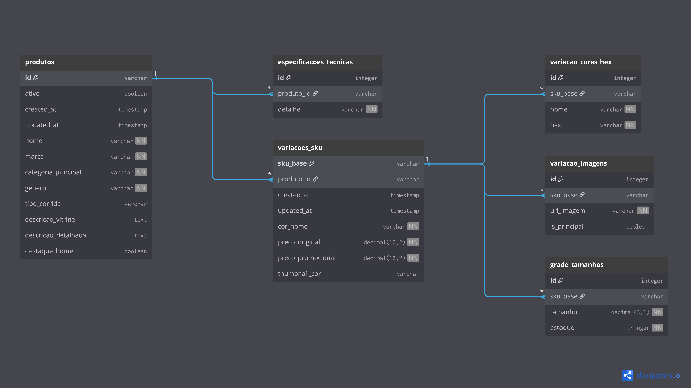

# Especificações Técnicas e Diário de Bordo - Projeto **Maratona**

Este documento tem como objetivo registrar e justificar todas as decisões técnicas tomadas durante o desenvolvimento do projeto **Maratona**, além de servir como um diário de progresso das tarefas executadas.

> [!NOTE]
> **Aviso de Co-autoria:** Parte da estruturação visual, formatação em Markdown e a redação final das justificativas técnicas deste documento foram feitas com o **Gemini** (Inteligência Artificial).

---

## Sumário
- [1. Diário de Desenvolvimento](#1-diário-de-desenvolvimento)
- [2. Identidade Visual e UI/UX](#2-identidade-visual-e-uiux)
  - [2.1. Benchmarking: Padrão da Indústria](#21-benchmarking-padrão-da-indústria)
  - [2.2. Justificativa da Paleta de Cores (White Theme)](#22-justificativa-da-paleta-de-cores-white-theme)
  - [2.3. Definição da Paleta de Cores](#23-definição-da-paleta-de-cores)
  - [2.4. Tipografia](#24-tipografia)
- [3. Engenharia de Dados e Estruturação do Catálogo](#3-engenharia-de-dados-e-estruturação-do-catálogo)
  - [3.1. Processo de Curadoria e Extração Manual](#31-processo-de-curadoria-e-extração-manual)
  - [3.2. Modelagem do Schema JSON (SKUs e Variações)](#32-modelagem-do-schema-json-skus-e-variações)
  - [3.3. Modelagem Relacional e Diagrama de Entidade-Relacionamento (MER/DER)](#33-modelagem-relacional-e-diagrama-de-entidade-relacionamento-merder)
  - [3.4. Perspectiva de Migração para Produção (PostgreSQL + Neon)](#34-perspectiva-de-migração-para-produção-postgresql--neon)

---

## 1. Diário de Desenvolvimento

Aqui serão registradas as tarefas executadas ao longo do projeto.

### [26/08/2026] - Planejamento de UI/UX + Catálogo 
- [x] Criação do arquivo de Especificações e Diário de Bordo.
- [x] Realização de análise de mercado e Benchmarking com grandes players.
- [x] Definição da paleta de cores.
- [x] Definição da tipografia.
- [x] Início da construção do catálogo de produtos em JSON.

### [27/08/2026] - Engenharia de Dados e Refinamento do Schema
- [x] Evolução do Schema JSON para suportar gestão de SKUs, múltiplas variações de cores e controle de estoque individual por tamanho.
- [x] Extração e curadoria manual de dados reais de tênis de alta performance.
- [x] Organização da arquitetura de pastas de imagens (adotando `.avif`).
- [x] Finalização do cadastro dos primeiros 8 produtos (totalizando quase 20 SKUs completos).
- [x] Documentação da estratégia de migração de dados para o PostgreSQL (Neon).
- [x] Inclusão das colunas de auditoria (created_at, updated_at) e soft delete (ativo) no Schema JSON.
- [x] Criação e documentação do Modelo Entidade-Relacionamento (MER/DER).

---

## 2. Identidade Visual e UI/UX

### 2.1. Benchmarking: Padrão da Indústria

Para definir a identidade visual e a paleta de cores do e-commerce, foi realizada uma análise detalhada da Interface de Usuário (UI)  de algumas das principais marcas de artigos esportivos do mercado: **Nike, Adidas, Reebok, Fila, Puma e Mizuno**. 

O padrão da indústria que se destacou de forma claríssima foi a utilização unânime de **fundos 100% brancos** na área de vitrine, combinados com textos e ícones em **preto absoluto**, garantindo alto contraste e amplas áreas de respiro (*whitespace*). Nessas interfaces, as cores de identidade da marca (como o vermelho da Reebok ou o azul da Mizuno) são restritas a pequenos pontos de destaque, como logotipos ou botões. A intenção é que a fotografia do produto (seja em fundo infinito ou cenas de *lifestyle*, como faz a Nike) domine completamente o campo visual.

Para ilustrar essa análise, abaixo estão algumas referências dos sites analisados: 

  

### 2.2. Justificativa da Paleta de Cores (White Theme)

> *"Por que todas as gigantes do mercado esportivo adotam esse padrão minimalista?"*

No e-commerce de artigos esportivos, **o produto é a única estrela**. Vestuário de corrida e tênis de alta performance já costumam ter cores extremamente agressivas e vibrantes (verde neon, laranja choque, solados coloridos, detalhes reflexivos). 

Se aplicarmos um fundo escuro (Dark Mode) ou muito chamativo no site, o visual geral ficará poluído. O fundo acabaria "brigando" com a fotografia do produto pela atenção do usuário. O fundo branco puro (ou *off-white*) resolve essa questão pois:

1.  Faz com que as cores do tênis saltem e ganhem destaque imediato na tela.
2.  Passa uma sensação de ambiente limpo, organizado e seguro (fatores essenciais para transmitir confiança na hora de passar o cartão de crédito).
3.  Melhora absurdamente a legibilidade dos textos descritivos e dos preços.

### 2.3. Definição da Paleta de Cores

Para a loja **Maratona**, a paleta com destaque em **laranja** se encaixa perfeitamente na proposta de "Alta Performance". Ela cria o contraste agressivo desejado, mas mantendo a viabilidade comercial que deixará a loja com o aspecto visual de uma gigante do varejo esportivo.

Abaixo, a estruturação base do projeto:

*   **Fundo (Background):** `#FFFFFF`
*   **Texto Principal/Títulos:** `#000000`
*   **Textos Secundários/Rodapé:** `#1A1A1A`
*   **Destaque Primário (Botões de Compra):** `#FF7C00`
*   **Destaque Secundário (Tags/Hover):** `#FE9A28`

  

### 2.4. Tipografia

As fontes escolhidas (via Google Fonts) focam em transmitir movimento e garantir legibilidade:

*   **Títulos (Headers/Banners):** `Barlow Condensed`
    *   *Uso:* Peso **800 (ExtraBold) em Itálico**.
    *   *Justificativa:* A inclinação do itálico aliada à espessura da fonte transmite a sensação de velocidade e avanço, alinhando-se à estética de alta performance.
*   **Corpo de Texto (Preços, descrições, botões):** `Inter`
    *   *Uso:* Pesos **300 (Light) ou 400 (Regular)**.
    *   *Justificativa:* Fonte altamente legível e limpa. Seu design neutro equilibra a agressividade visual da Barlow, garantindo conforto na leitura técnica.

---

## 3. Engenharia de Dados e Estruturação do Catálogo

### 3.1. Processo de Curadoria e Extração Manual

Para garantir um nível de excelência e realismo no e-commerce, optou-se por não utilizar geradores automáticos de dados genéricos. O catálogo da **Maratona** foi construído através de um meticuloso trabalho manual de engenharia de dados.

O processo consistiu em mapear produtos reais em grandes e-commerces do segmento esportivo (como a loja oficial da Adidas) e realizar a extração minuciosa de:
*   Descrições otimizadas para vendas (textos de vitrine) e especificações técnicas reais (drop, peso, materiais da entressola).
*   Catálogo de imagens em alta definição, realizando o download e a conversão/manutenção para o formato web moderno `.avif`, que oferece performance superior de carregamento.
*   Organização hierárquica severa das pastas no projeto (ex: `/Produtos/04/Cinza/...`), separando os assets por ID e por cor.

### 3.2. Modelagem do Schema JSON (SKUs e Variações)

A estrutura do `produtos_mock.json` foi desenhada para emular a arquitetura complexa de sistemas corporativos de varejo. O schema abandonou a ideia de tratar um calçado como um item global, adotando o conceito de **SKU (Stock Keeping Unit)**.

Essa modelagem de dados "Padrão Ouro" suporta características avançadas de negócio:
*   **Variações Independentes:** Um mesmo modelo de tênis engloba múltiplos objetos para cada cor disponível.
*   **Precificação Dinâmica:** O sistema permite que cada variação de cor tenha seu próprio preço (refletindo a realidade do mercado onde cores diferentes do mesmo produto podem entrar em promoções de queima de estoque individualmente).
*   **Estoque por Grade Rigorosa:** O controle de disponibilidade não é geral, mas atrelado especificamente a cada número do pé. Isso possibilita o desenvolvimento de regras de negócio precisas no Frontend (React), como a desabilitação automática do botão de compra quando o estoque de um tamanho específico chega a zero.

### 3.3. Modelagem Relacional e Diagrama de Entidade-Relacionamento (MER/DER)

Para garantir uma transição segura entre a estruturação estática (JSON) e o banco de dados em produção (PostgreSQL via Neon), o Modelo Entidade-Relacionamento físico foi documentado antes da implementação do Backend.

*   **Origem da Modelagem:** O esquema foi gerado traduzindo diretamente a estrutura "Padrão Ouro" do nosso arquivo JSON para DBML. Os arrays de dados aninhados foram estritamente normalizados em tabelas relacionais independentes com cardinalidade 1:N.
*   **Propósito Técnico:** Desenhar as entidades visualmente previne falhas de arquitetura antes da codificação e documenta as restrições físicas do PostgreSQL, assegurando a correta tipagem para dados financeiros (`decimal(10,2)`), injeção de timestamps de auditoria e a implementação de *soft delete*.

  

### 3.4. Perspectiva de Migração para Produção (PostgreSQL + Neon)

Embora a aplicação inicie seu desenvolvimento consumindo o arquivo JSON, essa arquitetura de dados não é definitiva. O JSON atua apenas como um provedor de dados confiável (seeder) para acelerar o desenvolvimento e os testes de interface.

Toda a modelagem hierárquica foi construída visando uma **transição direta e normalizada para um banco de dados relacional**. Em fases posteriores do projeto, todos esses dados serão migrados para um banco **PostgreSQL**, que será hospedado em nuvem utilizando a plataforma **Neon**. 

A estrutura em JSON mapeia perfeitamente para as futuras tabelas do banco de dados (ex: `Produtos`, `SKUs_Variacoes`, `Grades_Tamanhos` e `Galeria_Imagens`), garantindo que o Backend possa ser integrado sem a necessidade de refatorar a lógica de dados construída nesta etapa.

---

